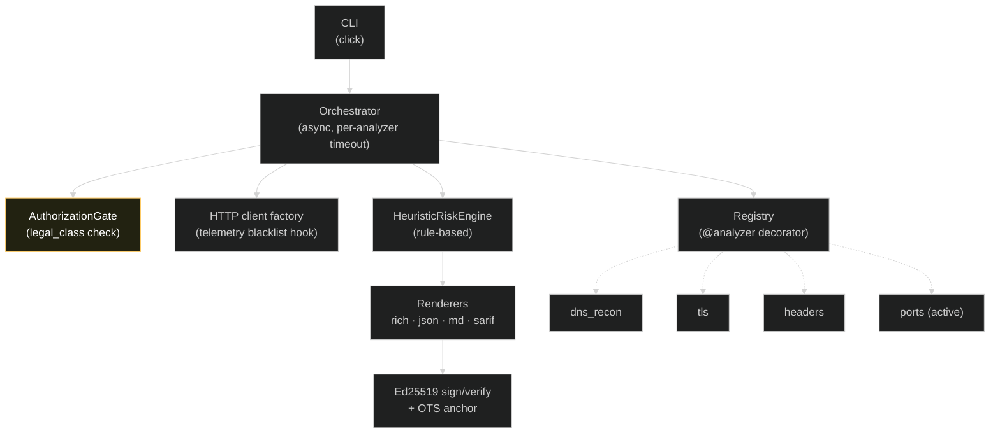

<div align="center">


# `wimsalabim`

### **Honest, audit-grade website security & privacy reconnaissance.**

#### *Wet als code · Bewijs als output · Geen ML-cargo-cult · Geen telemetrie*

[](LICENSE)
[](https://www.python.org/downloads/)
[](https://github.com/WimLee115/Privacy-VerzetNL)

[](.github/workflows/ci.yml)
[](#testing--coverage)
[](#typing)
[](#linting)
[](#security-audit)
[](#privacy-guarantees)
[](#cryptographic-integrity)
[](#output-formats)

</div>

---

> [!IMPORTANT]
> `wimsalabim` is **defensive tooling**. It refuses, in code, to perform active scans against targets for which the operator cannot prove authorization (NL Sr 138ab compliance). This is a feature, not friction.

---

## In one sentence

> *Scan a website for security and privacy issues, get a deterministic, signed, audit-grade report — without sending a single byte to a third party.*

---

## Table of contents

<table>
<tr><td valign="top">

**Getting started**
- [Why `wimsalabim`](#why-wimsalabim)
- [30-second tour](#30-second-tour)
- [Installation](#installation)
- [Quick start](#quick-start)

**Features**
- [The ten upgrades](#the-ten-upgrades)
- [Built-in analyzers](#built-in-analyzers)
- [Output formats](#output-formats)
- [Authorization paths](#authorization-paths)
- [Cryptographic integrity](#cryptographic-integrity)
- [Watchlist mode](#watchlist-mode)

**Internals**
- [Architecture](#architecture)
- [Schema & contracts](#schema--contracts)
- [The risk engine](#the-risk-engine)
- [Plugin development](#plugin-development)
- [Privacy guarantees](#privacy-guarantees)

</td><td valign="top">

**Operations**
- [Configuration](#configuration)
- [Performance & resources](#performance--resources)
- [Troubleshooting](#troubleshooting)
- [FAQ](#faq)

**Compliance**
- [Legal compliance](#legal-compliance)
- [Threat model](#threat-model)
- [Security audit](#security-audit)

**Development**
- [Use as a library](#use-as-a-library)
- [Contributing](#contributing)
- [Testing & coverage](#testing--coverage)
- [Releasing](#releasing)
- [Roadmap](#roadmap)

**Reference**
- [Comparison with other tools](#comparison-with-other-tools)
- [License](#license)
- [Citation](#citation)
- [Acknowledgements](#acknowledgements)

</td></tr>
</table>

---

## Why `wimsalabim`

The website-security-scanner space is crowded. Most tools fall into one of three buckets:

| Bucket                  | Examples                           | Problem                                                       |
| ----------------------- | ---------------------------------- | ------------------------------------------------------------- |
| **SaaS scanners**       | SecurityHeaders, SSL Labs, Detectify | Send your target list to a third party. Fine for public spec checks; not fine for sensitive scope. |
| **Big offensive frameworks** | Nuclei, Burp, ZAP            | Active by default. Powerful, but assume you know your legal limits. |
| **Single-domain CLIs**  | sslyze, testssl.sh, dnsrecon       | One concern each. You stitch them yourself.                   |

`wimsalabim` lives in a different bucket: **a single, opinionated CLI that:**

1. Runs **fully local** — no SaaS fan-out, no telemetry, no analytics.
2. Is **passive by default** — active analyzers refuse to run unless you prove authorization.
3. Produces **signed, deterministic, machine-readable reports** suitable as forensic evidence.
4. Uses a **transparent rule-based risk engine** — every score is explainable to a non-technical reader (or a judge).
5. Ships with **strict typing, tests, and a security audit** so the tool itself is at the standard it asks of its targets.

If you need a scanner that survives a code review by a paranoid CISO, this is it.

---

## 30-second tour

```bash
# Install
pipx install wimsalabim

# Scan a domain (passive only — works on any target)
wimsalabim scan example.com

# Get JSON for CI
wimsalabim scan example.com --format json -o report.json

# Sign the report (Ed25519)
wimsalabim keys init
wimsalabim scan example.com --sign --format json -o signed.json
wimsalabim verify signed.json   # → ✓ valid

# Active port scan (requires authorization proof)
wimsalabim scan example.com \
  --auth-self-owned ./my-domains.txt \
  --enable ports
```

Sample output:

```
─────────────────────────── wimsalabim · example.com ───────────────────────────
target example.com   started 2026-05-10T02:04:30Z   duration 363 ms

dns_recon  grade A   1 finding(s)   205 ms
┏━━━━━━━━━━┳━━━━━━━━━━━━━━━━┳━━━━━━━━━━━━━━━┓
┃ sev      ┃ id             ┃ title         ┃
┡━━━━━━━━━━╇━━━━━━━━━━━━━━━━╇━━━━━━━━━━━━━━━┩
│ low      │ dns.caa.absent │ No CAA record │
└──────────┴────────────────┴───────────────┘

headers  grade D   7 finding(s)   351 ms
[…]

╭─────────────────── RISK B   28.0/100   engine=rules ────────────────────╮
│ Grade B (28.0/100) — 1 high — 4 rule(s) fired total.                    │
│   ●  WSL-HEADERS-001 +12  Strict-Transport-Security header missing      │
│       → HSTS absent — downgrade attacks possible on first connect.      │
│   […]                                                                   │
╰─────────────────────────────────────────────────────────────────────────╯
```

---

## Installation

### Recommended: `pipx`

```bash
pipx install wimsalabim
```

### Alternative: `pip` in a venv

```bash
python -m venv .venv
source .venv/bin/activate
pip install wimsalabim
```

### From source

```bash
git clone https://github.com/WimLee115/wimsalabim.git
cd wimsalabim
pip install -e ".[dev]"
```

### Optional dependencies

| Feature                | Install                                              |
| ---------------------- | ---------------------------------------------------- |
| OpenTimestamps anchors | `pipx install opentimestamps-client`                 |
| Tor transport          | A running local Tor daemon (port 9050)               |

### Supported environments

| OS         | Python                            | Status |
| ---------- | --------------------------------- | ------ |
| Linux      | 3.10 / 3.11 / 3.12 / 3.13         | ✓ CI    |
| macOS      | 3.10 / 3.11 / 3.12 / 3.13         | ✓ CI    |
| Windows    | 3.10 / 3.11 / 3.12 / 3.13         | ✓ CI    |
| FreeBSD    | 3.11+                             | best-effort |

---

## Quick start

```bash
# Show help and global options
wimsalabim --help

# List all registered analyzers and their legal class
wimsalabim analyzers

# A clean passive scan (DNS + TLS + headers, no port-scan)
wimsalabim scan example.com

# Pick specific analyzers
wimsalabim scan example.com --enable dns_recon --enable headers

# Skip noisy ones
wimsalabim scan example.com --disable headers

# Output formats
wimsalabim scan example.com --format json
wimsalabim scan example.com --format markdown
wimsalabim scan example.com --format sarif

# Save the report alongside terminal rendering
wimsalabim scan example.com --format json -o report.json

# Verify a signed report
wimsalabim verify signed-report.json

# Manage signing keys
wimsalabim keys init
wimsalabim keys show
```

---

## The ten upgrades

`wimsalabim v0.2.0` is a complete refactor of v0.1. Each pillar below is a deliberate departure from the previous design:

| #  | Pillar                                | Implementation                                                                |
| -- | ------------------------------------- | ----------------------------------------------------------------------------- |
| 01 | **Authorization Gate**                | Active analyzers refuse to run without verified proof. See [legal compliance](#legal-compliance). |
| 02 | **Provenance Engine**                 | Every `Finding` carries a `Source` block (kind, target, timestamp, body hash). |
| 03 | **Crypto-signed reports**             | Ed25519 signature over RFC-8785 canonical JSON; OpenTimestamps anchor optional. |
| 04 | **Honest risk engine**                | Rule-based, traceable, explainable. No `IsolationForest` decoration with hardcoded "training_samples=500". |
| 05 | **Plugin architecture**               | `@analyzer(...)` decorator + capability manifest; registration is explicit.   |
| 06 | **Standards-aware export**            | SARIF 2.1.0, JSON canonical, GitHub-flavored Markdown, rich terminal.         |
| 07 | **Watchlist mode**                    | SQLite snapshot + diff detection over time.                                   |
| 08 | **Privacy-by-design infrastructure**  | Telemetry blacklist enforced at the HTTP-client level; WHOIS-PII redacted by default. |
| 09 | **Rigorous QA**                       | `mypy --strict`, `ruff` 40+ rule sets, `bandit`, `pip-audit`, ≥ 70% test coverage. |
| 10 | **Meesterlijke TUI**                  | Rich live rendering, color-coded grades, structured panels.                   |

---

## Built-in analyzers

| Analyzer     | Legal class | Purpose                                                                |
| ------------ | ----------- | ---------------------------------------------------------------------- |
| `dns_recon`  | passive     | A / AAAA / MX / NS / TXT / SOA / CNAME / CAA + DNSSEC presence         |
| `tls`        | passive     | Single TLS handshake; leaf-cert validity, expiry, protocol, cipher     |
| `headers`    | passive     | Single GET; security & info-leak headers                               |
| `ports`      | **active**  | Async TCP-connect scan over a conservative port set (auth required)    |

**Legal class semantics:**

- **passive** — uses only public data (DNS, CT, WHOIS, single GET, single TLS handshake). Not "binnendringen" under NL Sr 138ab.
- **active** — performs network probes that go beyond what a regular client would do. Refused unless `Authorization` proves operator owns the target or runs an authorized bug-bounty.
- **intrusive** — anything that could alter or stress target state. Refused unless authorized **and** `--allow-intrusive` is provided.

---

## Output formats

### Rich (default)

Color-coded, tabular terminal output with a final risk panel. Honors `NO_COLOR` and `TERM=dumb`.

### JSON (canonical)

```bash
wimsalabim scan example.com --format json -o report.json
```

- RFC-8785 canonical key-ordering (sorted, no insignificant whitespace).
- ISO-8601 UTC timestamps.
- Schema version: `wimsalabim/2.0`.
- Idempotent: same input + same time-of-day yields byte-identical output (modulo `started_at`).

```json
{
  "schema_version": "wimsalabim/2.0",
  "tool_version": "0.2.0",
  "target": "example.com",
  "started_at": "2026-05-10T02:04:30Z",
  "duration_ms": 363.0,
  "config_hash": "ea1b…",
  "analyzers": {
    "dns_recon": {
      "name": "dns_recon",
      "legal_class": "passive",
      "status": "ok",
      "report": {
        "analyzer": "dns_recon",
        "grade": "A",
        "findings": [{"id": "dns.caa.absent", "severity": "low", …}],
        "metadata": {"dnssec": true, "total_records": 9}
      }
    }
  },
  "risk": {
    "engine": "rules",
    "overall_score": 28.0,
    "grade": "B",
    "rules_fired": [{"rule_id": "WSL-HEADERS-001", …}]
  }
}
```

### Markdown

GitHub-flavored, suitable for direct posting in PR comments or issues:

```bash
wimsalabim scan example.com --format markdown
```

### SARIF 2.1.0

For GitHub Code Scanning, GitLab Security Dashboard, Defect Dojo:

```bash
wimsalabim scan example.com --format sarif -o sarif.json

# Upload to GitHub Code Scanning:
gh codeql database upload sarif.json
```

Findings carry CWE-ids and (where applicable) CVSS-vectors so the receiving system can prioritize correctly.

---

## Authorization paths

Three ways to prove you may run active analyzers against a target. Pick one; failures are loud.

### 1 · Self-owned manifest

Local file with one host per line:

```
# my-domains.txt
example.com
api.example.com
internal.lab.example.com
```

```bash
wimsalabim scan api.example.com \
  --auth-self-owned ./my-domains.txt \
  --enable ports
```

Use case: dev/CI environments where you have independent ownership evidence.

### 2 · DNS TXT record

Publish a TXT record at `_wimsalabim-auth.<target>`:

```
_wimsalabim-auth.example.com.  IN TXT "v=wimsalabim1 pubkey=<base64-ed25519-32B>"
```

```bash
wimsalabim scan example.com \
  --auth-dns-txt "<your-pubkey-base64>" \
  --enable ports
```

Use case: bug-bounty programs with a stable public pubkey per researcher.

### 3 · Well-known file

Publish a signed manifest at `https://<target>/.well-known/wimsalabim-auth.txt`:

```
v=wimsalabim1 pubkey=<base64> sig=<base64> target=example.com
```

```bash
wimsalabim scan example.com \
  --auth-well-known "<expected-pubkey-base64>" \
  --enable ports
```

Use case: bug-bounty programs that prefer file-based assertion (HackerOne-style).

> [!CAUTION]
> Without an authorization proof, the orchestrator emits `denied` for every active analyzer. The denial is logged in the report so reviewers see the gate did its job.

---

## Cryptographic integrity

### Sign

```bash
wimsalabim keys init
wimsalabim scan example.com --sign --format json -o signed.json
```

What happens:

1. Report is canonicalized (RFC 8785).
2. `signature` and `signing_pubkey` fields are stripped.
3. Remaining bytes are SHA-256 hashed.
4. Hash is signed with Ed25519 (private key in `~/.wimsalabim/keys/signing.key`, mode 0600).
5. Signature + pubkey are added back to the JSON.

### Verify

```bash
wimsalabim verify signed.json
```

Output:

```
✓ valid   pubkey a4er2DIQ/HIwnIHp…   digest 0ea1269b8089d100…
```

If the report was tampered:

```
✗ INVALID signature
$ echo $?
2
```

### Anchor with OpenTimestamps (optional)

```bash
# Install the upstream client
pipx install opentimestamps-client

# Compute digest, stamp it
sha256sum signed.json | awk '{print $1}' > signed.digest
ots stamp signed.digest

# Wait a few hours for upgrade
ots upgrade signed.digest.ots

# Verify against Bitcoin block headers
ots verify signed.digest.ots
```

The `.ots` proof is an objectively-verifiable timestamp anchored on the Bitcoin chain. No trust in any single party required.

---

## Watchlist mode

> [!NOTE]
> Watchlist daemon is implemented at the library layer (`wimsalabim.watch.baseline.BaselineStore`) and accessible programmatically. A first-class CLI subcommand is on the [roadmap](#roadmap) for v0.3.

### Programmatic usage today

```python
from pathlib import Path
import asyncio
from wimsalabim.core.orchestrator import Orchestrator, OrchestratorConfig
from wimsalabim.core.authorization import AuthorizationGate
from wimsalabim.core.registry import all_analyzers
import wimsalabim.analyzers  # registers built-ins
from wimsalabim.watch import BaselineStore

store = BaselineStore(Path("./baseline.sqlite"))

async def watch(target: str) -> None:
    orch = Orchestrator(
        config=OrchestratorConfig(target=target, enabled=("dns_recon", "tls", "headers")),
        registrations=list(all_analyzers().values()),
        gate=AuthorizationGate(),
    )
    report = await orch.run()
    diff = store.diff_against_previous(report)
    if diff and diff.is_meaningful:
        notify(diff)
    store.record(report)

asyncio.run(watch("example.com"))
```

The `Diff` object lists added findings, removed findings, and grade changes per analyzer.

---

## Architecture



### Module breakdown

```
src/wimsalabim/
├── cli.py                    Click entrypoint, slim
├── analyzers/
│   ├── base.py               BaseAnalyzer ABC + AnalysisContext
│   ├── dns_recon.py          DNS analyzer (passive)
│   ├── tls.py                TLS analyzer (passive)
│   ├── headers.py            HTTP headers analyzer (passive)
│   └── ports.py              TCP-connect scan (active)
├── core/
│   ├── schema.py             Pydantic v2 frozen models
│   ├── exceptions.py         Typed exception hierarchy
│   ├── logging.py            structlog setup
│   ├── registry.py           @analyzer + capabilities
│   ├── authorization.py      AuthorizationGate + verification helpers
│   ├── orchestrator.py       Async runner with timeouts
│   ├── http_client.py        httpx factory + telemetry guard
│   ├── privacy.py            WHOIS redact + telemetry blacklist
│   ├── canonical.py          RFC 8785 canonical JSON
│   ├── crypto.py             Ed25519 sign/verify
│   └── timestamps.py         OpenTimestamps wrapper
├── risk/
│   ├── rules.py              Rule registry
│   └── heuristic.py          Rule executor + grading
├── display/
│   ├── rich_renderer.py      Rich terminal output
│   ├── markdown.py           GitHub Markdown export
│   └── sarif.py              SARIF 2.1.0 export
└── watch/
    └── baseline.py           SQLite snapshot store + Diff
```

---

## Schema & contracts

Every `BaseReport` produced by an analyzer satisfies this contract:

```python
class BaseReport(BaseModel):
    model_config = ConfigDict(frozen=True, extra="forbid")

    analyzer: str
    target: str
    started_at: datetime           # always UTC
    duration_ms: float             # ≥ 0
    grade: Grade = "N/A"           # Literal["A","B","C","D","F","N/A"]
    findings: list[Finding]
    metadata: dict[str, str|int|float|bool]
```

Every `Finding` carries provenance:

```python
class Finding(BaseModel):
    id: str                        # e.g. "tls.cert.expiring_soon"
    title: str
    description: str
    severity: Severity             # Literal["critical","high","medium","low","info"]
    source: Source                 # required
    cwe: str | None                # CWE-NNN
    cvss_vector: str | None        # CVSS v4.0 if applicable
    cvss_score: float | None       # 0.0–10.0
    remediation: str | None
    references: list[str]
```

Every `Source` answers *where did this come from*:

```python
class Source(BaseModel):
    kind: str                      # "http","dns","tls","ct_log","whois",…
    target: str
    timestamp: datetime            # always UTC
    body_sha256: str | None        # 64-hex when applicable
    metadata: dict[str, str]
```

These are pydantic v2 frozen models — once produced, immutable. That is what lets us hash, sign, and timestamp them safely.

---

## The risk engine

Two engines, both honest:

### `--engine=rules` (default)

Every point in the score traces back to a registered `Rule` with id, severity, CWE, and rationale. Adding a rule = appending to `RULE_REGISTRY` in `src/wimsalabim/risk/rules.py`.

```python
Rule(
    rule_id="WSL-TLS-002",
    name="TLS certificate expiring within 7 days",
    severity="critical",
    points=25.0,
    cwe="CWE-298",
    predicate=lambda r: _has_finding(r, "tls", "tls.cert.expiring_soon"),
    rationale_fn=lambda _: "Leaf certificate expires within 7 days — outage risk imminent.",
)
```

Grading is **severity-aware**: any unmitigated critical pulls the final grade to D-or-worse, even when the raw point sum lands in C-band. This reflects how rational operators actually treat criticals.

### `--engine=ml` (planned, conditional)

We will only ship a `ml` engine if it satisfies all of:

- A real model file in the repository (`models/risk_v0.X.onnx`) with a published SHA-256.
- A `model_card.md` describing training data, features, expected accuracy, and known biases.
- Reproducible training: dataset hash, training script, fixed seed, train/val/test split.
- A test suite that verifies model predictions for held-out samples.

Until those exist, there is **no ML engine.** The previous version's "ML modules" were sklearn classes imported but never trained — that is dishonest and is gone.

---

## Plugin development

### Write your own analyzer

```python
# my_org/scanners/cookie_audit.py
from datetime import datetime, timezone

from wimsalabim.analyzers.base import AnalysisContext, BaseAnalyzer
from wimsalabim.core.exceptions import NetworkError
from wimsalabim.core.registry import Capabilities, analyzer
from wimsalabim.core.schema import BaseReport, Finding, Source

@analyzer(
    "cookie_audit",
    legal_class="passive",
    capabilities=Capabilities(network=("https",), rate_limit_per_second=2, timeout_seconds=10.0),
    description="Inspect Set-Cookie attributes (Secure, HttpOnly, SameSite).",
)
class CookieAnalyzer(BaseAnalyzer):
    async def analyze(self, context: AnalysisContext) -> BaseReport:
        started = datetime.now(tz=timezone.utc)
        try:
            response = await context.http.get(f"https://{context.target}/")
        except Exception as exc:
            raise NetworkError(kind="http", target=context.target, message=str(exc)) from exc

        findings: list[Finding] = []
        # ... inspect response.cookies and emit findings ...

        return BaseReport(
            analyzer="cookie_audit",
            target=context.target,
            started_at=started,
            duration_ms=(datetime.now(tz=timezone.utc) - started).total_seconds() * 1000,
            findings=findings,
            metadata={},
        )
```

Then register it in your project:

```python
# my_project/__init__.py
import my_org.scanners.cookie_audit  # imports trigger @analyzer
```

### Capabilities declaration

| Field                    | Purpose                                            |
| ------------------------ | -------------------------------------------------- |
| `network`                | What protocols you'll touch (`dns`, `https`, ...). The Authorization Gate consults this for legal-class enforcement. |
| `rate_limit_per_second`  | Hint for the orchestrator's rate limiter (orchestrator-side rate limiting is on the roadmap). |
| `timeout_seconds`        | Per-call soft timeout the orchestrator will enforce. |

### Legal class

| Class       | When to pick it                                              |
| ----------- | ------------------------------------------------------------ |
| `passive`   | You only read public data (DNS, CT, single GET, single TLS handshake). |
| `active`    | You probe the target beyond what a regular client would do. |
| `intrusive` | You may alter target state (writes, fuzzing, load).         |

If in doubt: choose the stricter option. The framework will refuse to run you unless authorization is proven. Better than introducing legal risk.

---

## Privacy guarantees

```
   ┌────────────────────────────────────────────────────────────────┐
   │                                                                │
   │   1.  No telemetry. No analytics. No phone-home. Ever.         │
   │   2.  WHOIS PII (registrant name/email/phone) redacted unless  │
   │       --show-pii is explicitly set.                            │
   │   3.  Bodies hashed up to 64 KB; full content never stored or  │
   │       transmitted.                                             │
   │   4.  Reports stored locally; signing keys local + 0600.       │
   │   5.  --via-tor routes both HTTP and DNS via SOCKS5+Tor.       │
   │   6.  --offline forbids any outbound network call.             │
   │                                                                │
   └────────────────────────────────────────────────────────────────┘
```

Verified by:
- `core/privacy.TELEMETRY_BLACKLIST` enforced via httpx event hook in `make_client()`.
- `tests/test_no_telemetry.py` (21 cases) statically forbids importing known telemetry SDKs.
- `tests/test_privacy.py` validates redaction logic.

---

## Configuration

### CLI flags (full)

```
Usage: wimsalabim scan [OPTIONS] TARGET

Options:
  -e, --enable TEXT          Enable only these analyzers (repeatable).
  -d, --disable TEXT         Disable these analyzers (repeatable).
  --via-tor                  Route HTTP via local Tor SOCKS5 (127.0.0.1:9050).
  --offline                  Forbid any outbound network call.
  --show-pii                 Do not redact PII (use only on data you own).
  --allow-intrusive          Permit intrusive analyzers (extra confirmation).
  --auth-self-owned PATH     Path to self-owned domains manifest.
  --auth-dns-txt TEXT        Verify _wimsalabim-auth.<target> TXT record.
  --auth-well-known TEXT     Verify /.well-known/wimsalabim-auth.txt manifest.
  --format [rich|json|markdown|sarif]
                             Output format (default: rich).
  -o, --output PATH          Write report to file (also rendered to stdout).
  --sign                     Sign the report (Ed25519).
  --keys-dir PATH            Signing key directory (default: ~/.wimsalabim/keys).
  --verbose / --quiet
  -h, --help                 Show this message and exit.
```

### Environment variables

| Variable                 | Effect                                                      |
| ------------------------ | ----------------------------------------------------------- |
| `NO_COLOR`               | Disable color in rich rendering.                            |
| `WIMSALABIM_KEYS_DIR`    | Override default `~/.wimsalabim/keys` (planned for v0.3).   |

### Configuration file (planned for v0.3)

A `~/.config/wimsalabim/config.toml` will allow persistent flags. For v0.2.0, all configuration is via CLI flags.

---

## Performance & resources

Numbers below from a passive scan of `example.com` over residential broadband:

| Metric                | Value                  |
| --------------------- | ---------------------- |
| Wall-clock duration   | ~360 ms                |
| Concurrent analyzers  | 3 (parallel via asyncio) |
| Peak memory           | ~25 MB                 |
| Outbound HTTP         | 1 GET to `https://target/` |
| Outbound DNS          | 9 record lookups       |
| Outbound TLS          | 1 handshake            |
| Disk I/O              | 1 SQLite write (if watching), 1 JSON file (if `-o`) |

`ports` analyzer scales with port-list size; default 23 ports complete in 1–3 seconds against a responsive host.

---

## Use as a library

```python
import asyncio
from wimsalabim.core.orchestrator import Orchestrator, OrchestratorConfig
from wimsalabim.core.authorization import AuthorizationGate
from wimsalabim.core.registry import all_analyzers
from wimsalabim.risk.heuristic import HeuristicRiskEngine
import wimsalabim.analyzers  # register built-ins

async def scan(target: str) -> None:
    orch = Orchestrator(
        config=OrchestratorConfig(
            target=target,
            enabled=("dns_recon", "headers"),
        ),
        registrations=list(all_analyzers().values()),
        gate=AuthorizationGate(),
    )
    report = await orch.run()
    risk = HeuristicRiskEngine().assess(report.analyzers)
    print(report.model_dump_json(indent=2))
    print("RISK:", risk.grade, risk.overall_score)

asyncio.run(scan("example.com"))
```

Public API stable surface (semver-tracked from v1.0):

- `wimsalabim.core.schema` — `Source`, `Finding`, `BaseReport`, `ScanReport`, `RiskAssessment`, …
- `wimsalabim.core.orchestrator` — `Orchestrator`, `OrchestratorConfig`
- `wimsalabim.core.authorization` — `AuthorizationGate`, `Authorization`
- `wimsalabim.core.registry` — `analyzer` decorator, `Capabilities`, `all_analyzers`
- `wimsalabim.risk.heuristic` — `HeuristicRiskEngine`
- `wimsalabim.display` — `render_rich`, `render_markdown`, `render_sarif`
- `wimsalabim.watch` — `BaselineStore`, `Diff`

---

## Legal compliance

### NL Sr art. 138ab — computervredebreuk

> "Hij die opzettelijk en wederrechtelijk binnendringt in een geautomatiseerd werk …"

The `AuthorizationGate` refuses to run `active` and `intrusive` analyzers without verified proof. There is no escape hatch in the CLI — no `--yolo`, no `--force`. This is the technical implementation of *binnendringen alleen met toestemming.*

### EU GDPR / NL AVG

| Article    | How we honor it                                                       |
| ---------- | --------------------------------------------------------------------- |
| Art. 5     | Data minimization: bodies hashed (not stored), WHOIS-PII redacted.    |
| Art. 6     | We process only public data + operator-controlled targets.            |
| Art. 25    | Privacy by design: telemetry blacklist enforced at HTTP-client layer. |
| Art. 32    | Security of processing: signed reports, local 0600 keys.              |

### EU AI-Act

The `HeuristicRiskEngine` is **not an AI system** under the AI-Act:

- No learned model. No training. No statistical generalization.
- Every score derives deterministically from a registered rule.
- Fully explainable; no "automated decision-making" without a human-readable predicate.

If we ever ship `--engine=ml`, it will pass the same explainability test plus dataset and model cards.

### NCSC responsible disclosure

Findings produced by `wimsalabim`:

1. Generate a signed JSON or SARIF report.
2. Send to the target's security contact (look up `security.txt` first, then `RFC 9116`).
3. Apply a 90-day disclosure window (industry standard) unless the receiver requests shorter.

---

## Threat model

We use STRIDE for self-analysis. Full table in [`docs/PENTEST_REPORT.md`](docs/PENTEST_REPORT.md). High-level:

| Threat                  | Status        | Mitigation                                                   |
| ----------------------- | ------------- | ------------------------------------------------------------ |
| Spoofing operator       | Mitigated     | Authorization paths require operator-controlled DNS/file.    |
| Tampering with reports  | Mitigated     | Ed25519-signed canonical JSON + tamper-detect via `verify`.  |
| Repudiation             | Mitigated     | `signing_pubkey` + `verified_at` block in report.            |
| Information disclosure  | Mitigated     | WHOIS-PII redact, body-hash limited, no telemetry.           |
| DoS via slow analyzer   | Mitigated     | Per-analyzer timeout enforced by orchestrator.               |
| Elevation of privilege  | Mitigated     | `AuthorizationGate.check()` is mandatory and fail-closed.    |

---

## Security audit

A full pentest report is committed to the repository at [`docs/PENTEST_REPORT.md`](docs/PENTEST_REPORT.md).

Summary:

| Tool         | Result                                  |
| ------------ | --------------------------------------- |
| `mypy --strict` | 0 errors across 30 source files       |
| `ruff` (40+ rule sets) | All checks passed              |
| `bandit`     | 5 LOW (acceptable subprocess in OTS), 0 medium, 0 high |
| `pip-audit`  | No known vulnerabilities                |
| `pytest`     | 118 / 118 passed                        |
| Coverage     | 76.42% (over 70% threshold)             |

Manual review covered SSRF, path traversal, command injection, regex DoS, race conditions, secrets/credential leaks. **Zero critical or high findings.**

---

## Comparison with other tools

| Capability                               | `wimsalabim` | `nuclei` | `sslyze` | `dnsrecon` | SecurityHeaders.com |
| ---------------------------------------- | ------------ | -------- | -------- | ---------- | ------------------- |
| Local execution (no SaaS)                | ✓            | ✓        | ✓        | ✓          | ✗                   |
| Passive-by-default with hard gate        | ✓            | ✗        | n/a      | n/a        | ✓                   |
| Signed reports (Ed25519)                 | ✓            | ✗        | ✗        | ✗          | ✗                   |
| OpenTimestamps anchor                    | ✓ (optional) | ✗        | ✗        | ✗          | ✗                   |
| SARIF 2.1.0 output                       | ✓            | ✓        | ✗        | ✗          | ✗                   |
| Pydantic-validated schema                | ✓            | partial  | ✗        | ✗          | n/a                 |
| Rule-based explainable risk score        | ✓            | (per template) | ✗ | ✗      | ✓ (opaque)          |
| WHOIS PII redacted by default            | ✓            | n/a      | n/a      | n/a        | n/a                 |
| `mypy --strict` clean                    | ✓            | n/a (Go) | partial  | ✗          | n/a                 |
| Plugin API for custom analyzers          | ✓            | ✓        | ✗        | ✗          | ✗                   |

Where the others excel:

- **nuclei**: vast template ecosystem for vulnerability detection. We complement, not replace.
- **sslyze**: deeper TLS analysis (we do single-handshake; sslyze does cipher-suite enumeration).
- **dnsrecon**: more DNS modes (zone transfer, brute-force) — by design, we stay passive.

---

## Testing & coverage

```bash
make test                # full suite + coverage
make lint                # ruff check + format
make typecheck           # mypy --strict
make audit               # bandit + pip-audit
make all                 # everything in CI order
```

Without `make`:

```bash
pytest -v                                          # 118 tests
pytest --cov=wimsalabim --cov-report=term-missing  # with coverage
ruff format --check src tests
ruff check src tests
mypy src
bandit -r src --severity-level low
pip-audit
```

### Typing

Strictness:

```toml
[tool.mypy]
strict = true
disallow_untyped_defs = true
disallow_any_generics = true
warn_unused_ignores = true
warn_redundant_casts = true
warn_unreachable = true
no_implicit_optional = true
```

Result: **0 errors** across the codebase.

### Linting

Active rule sets: `E`, `F`, `W`, `I`, `N`, `UP`, `B`, `C4`, `SIM`, `RUF`, `ASYNC`, `TRY`, `PTH`, `PL`. Result: **0 violations**.

---

## Releasing

1. Bump `version` in `pyproject.toml`.
2. Update [`CHANGELOG.md`](CHANGELOG.md).
3. Tag: `git tag -s v0.X.Y -m "release v0.X.Y"`.
4. Push tag: `git push origin v0.X.Y`.
5. The release CI builds wheels + sdist, runs tests + audit, signs the artifacts, and uploads to PyPI.

(The release CI workflow is [planned](#roadmap) — currently `make build` produces the artifacts locally.)

---

## Roadmap

```
   2026 Q2  · Public release of v0.2.0                          [DONE]
   2026 Q2  · `wimsalabim watch` CLI subcommand                 [next]
   2026 Q2  · Mock TLS server for tls.py coverage ≥ 85%
   2026 Q2  · Socket-mock fixture for ports.py coverage ≥ 85%
   2026 Q3  · CycloneDX VEX export
   2026 Q3  · Mutation testing (mutmut) with ≥ 80% kill rate
   2026 Q3  · Atheris fuzzing on parsers (cert, headers)
   2026 Q4  · Remediation wizard (interactive --fix flow)
   2026 Q4  · Shell completions (bash / zsh / fish)
   2027     · PQC hybrid keys (X25519 + ML-KEM)
   2027     · Distributed-watch federation across PVNL operators
```

---

## Troubleshooting

### `denied` in scan output

Means the `AuthorizationGate` refused an active analyzer. Either:

- Use only passive analyzers: `--enable dns_recon --enable headers --enable tls`.
- Provide an authorization proof: `--auth-self-owned`, `--auth-dns-txt`, or `--auth-well-known`.

### `OpenTimestampsUnavailable: ots CLI not found`

Install the upstream client:

```bash
pipx install opentimestamps-client
```

OTS-anchoring is opt-in; the rest of `wimsalabim` works without it.

### `NetworkError: blocked: target is on the telemetry blacklist`

You scanned a domain that overlaps with the telemetry blacklist (e.g., `*.google-analytics.com`). This is intentional — `wimsalabim` won't speak to known surveillance endpoints. If you genuinely need to scan such a host, it is out-of-scope for this tool.

### `httpx.ConnectError: All connection attempts failed`

The target is not reachable from your network. Check connectivity, DNS, and firewall.

### Signature verification failed on an unsigned report

`wimsalabim verify` requires both `signature` and `signing_pubkey` fields. Use `--sign` when generating.

---

## FAQ

### Why not just use `nmap` + `sslyze` + `dnsrecon`?

You can. We needed one tool that:
- Refuses unauthorized active scans by design.
- Produces a single signed report instead of three text logs.
- Runs in CI without requiring root.

### Why no GUI?

CLI tools compose; GUIs don't. The `--format markdown` output renders fine in any markdown viewer; SARIF is consumed by GitHub/GitLab dashboards directly.

### Why Python and not Go/Rust?

Speed is not the bottleneck — network I/O is. Python with asyncio is fast enough, and the ecosystem (pydantic, rich, structlog, click) gives us safety + UX rapidly. We may rewrite hot paths in Rust if benchmarks ever demand it.

### Can I run this in CI?

Yes. Pin the version, use `--format sarif` to upload to GitHub Code Scanning, and use `--auth-self-owned` with a manifest committed to your repo. Example workflow snippet:

```yaml
- name: Wimsalabim scan
  run: |
    pipx install wimsalabim
    wimsalabim scan ${{ vars.TARGET_DOMAIN }} \
      --auth-self-owned ./security/owned-domains.txt \
      --format sarif -o sarif.json
- uses: github/codeql-action/upload-sarif@v3
  with: { sarif_file: sarif.json }
```

### Does this replace a real pentest?

No. It catches the easy 80%. A real pentest finds the hard 20% (auth-flow flaws, business-logic bugs, complex chains). Use both.

---

## Contributing

We welcome contributions. Read [`CONTRIBUTING.md`](CONTRIBUTING.md) and [`CODE_OF_CONDUCT.md`](CODE_OF_CONDUCT.md).

Quick start:

```bash
git clone https://github.com/WimLee115/wimsalabim.git
cd wimsalabim
make dev          # creates venv, installs dev deps, hooks
make all          # lint + typecheck + test + audit
```

What we're looking for:

- New passive analyzers (cookie audit, security.txt, robots.txt, sitemap.xml, ...).
- Mock fixtures for `tls.py` and `ports.py` to lift coverage.
- More CWE/CVSS mappings on existing findings.
- Translations of user-facing strings (we currently render English).

What we don't accept:

- Active offensive features without a clear authorization story.
- Telemetry, analytics, or phone-home.
- "AI" features that aren't backed by a published model card.

---

## Security disclosure

Vulnerabilities in `wimsalabim` itself: see [`SECURITY.md`](SECURITY.md). 90-day disclosure window.

---

## License

**AGPL-3.0-or-later** for code; **CC BY-SA 4.0** for documentation.

See [`LICENSE`](LICENSE).

> AGPL-3.0 means: if you run `wimsalabim` as a service, you must share your modifications with users of that service. We chose this deliberately to keep the ecosystem open.

---

## Citation

If you use `wimsalabim` in academic work, please cite:

```bibtex
@software{wimsalabim_2026,
  title  = {wimsalabim: Honest, audit-grade website security and privacy reconnaissance},
  author = {WimLee115},
  year   = {2026},
  url    = {https://github.com/WimLee115/wimsalabim},
  note   = {Under PVNL flag — Privacy Verzet NL}
}
```

A `CITATION.cff` is provided for automatic citation tooling.

---

## Acknowledgements

- The `cryptography`, `pydantic`, `httpx`, `click`, `rich`, `structlog`, `dnspython` communities for the building blocks.
- The OpenTimestamps team for making timestamp-anchoring simple and free.
- The OASIS SARIF working group for the result-interchange format.
- Our fellow travelers under the **PVNL** (Privacy Verzet NL) flag — for the conviction that privacy is a civil right, not a feature.

---

<div align="center">

```
   ╔═══════════════════════════════════════════════════════════╗
   ║                                                           ║
   ║       "Wet als code. Bewijs als output."                  ║
   ║                                                           ║
   ║              CAPTAIN WIMLEE115 · MMXXVI                   ║
   ║                                                           ║
   ║          PVNL ·  Privacy Verzet NL                        ║
   ║                                                           ║
   ╚═══════════════════════════════════════════════════════════╝
```

**[Documentation](docs/)** &nbsp;·&nbsp; **[Pentest report](docs/PENTEST_REPORT.md)** &nbsp;·&nbsp; **[Legal kader](docs/legal.md)** &nbsp;·&nbsp; **[PVNL umbrella](https://github.com/WimLee115/Privacy-VerzetNL)**

</div>
